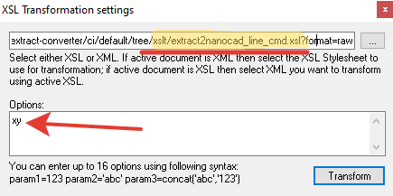

# Конвертирование xml файлов выписок из ЕГРН

Автор: Гришкин Максим

Лицензия: MIT License

## Выходные форматы

- семантические данные в формате "значения, разделённые запятыми" (.csv);
- универсальный обменный формат ГИС Esri ShapeFile;
- "переходник" для открытия ShapeFile в MapInfo;
- запрос SQL на вставку данных в таблицу базы данных;

## Ограничение

Поддерживает только земельные участки

## Установка

1. Скачать и установить [Python](https://www.python.org/downloads/) минимум версии 3.7.
2. Установить менеджер виртуального окружения [pipenv](https://pipenv.pypa.io/en/latest/):

- автоматически, запустив файл [install_venv.bat](./install_venv.bat). В данном случае будет также установлен pipx для
  создания изолированного окружения для pipenv;
- если при установке появятся ошибки, то установите pipenv вручную, выполнив инструкции с
  официального [сайта](https://pipenv.pypa.io/en/latest/);

## Инструкция использования

1. Создайте в корне приложения каталог "in"
2. Разместите xml файлы в каталог "in "
3. Запустите файл [start_convert.bat](./start_convert.bat "start_convert.bat")
4. Заберите результат из каталога out

# Бонус для пользователей NanoCad/AutoCad, использующих Notepad++

Бывают случаи. когда ты открыл в своем любимом [Notepad++](https://notepad-plus-plus.org) маленькую выписку и хочешь просто вытащить из неё координаты, а затем закинуть в открытый чертеж NanoCad.

Как вариант превратить выписку-xml в строку вида:

```
pline -4501.25,-33685.71 -4497.95,-33688.16 -4499.21,-33689.91 -4502.32,-33687.47 -4501.25,-33685.71
```

А затем просто вставить эту строку в командное окно NanoCad.

Xml как раз и проектировался, чтобы дать возможность простого преобразования из одного xml формата в другой.
Преобразование xml-файлов записывается в xsl-файл на специальном языке — XSLT (eXtensible Stylesheet Language
Transformations).
Для Notepad++ существует плагин XML Tools, который поддерживает пользовательские xsl-файлы.

Данный репозиторий включает xsl-файлы для NanoCad (xslt/extract2nanocad_line_cmd.xsl)
и AutoCad (xslt/extract2acad_line_cmd.xsl).
Можете скачать эти файлы себе или скопировать **raw**-ссылки на них.
Обратите внимание, что скачивать и ссылаться нужно на сырой (raw) файл, а не на просмоторщик хостинга.
Примеры raw-ссылок на два зеркала репозитория: [GitHub](github.com) и [SourceForge](sourceforge.net):
[NanoCad на GitHub](https://raw.githubusercontent.com/gmaFFFFF/extract-converter/develop/xslt/extract2nanocad_line_cmd.xsl)
[AutoCad на GitHub](https://raw.githubusercontent.com/gmaFFFFF/extract-converter/develop/xslt/extract2acad_line_cmd.xsl)
[NanoCad на SourceForge](https://sourceforge.net/p/cadaster-utils/extract-converter/ci/default/tree/xslt/extract2nanocad_line_cmd.xsl?format=raw)
[AutoCad на SourceForge](https://sourceforge.net/p/cadaster-utils/extract-converter/ci/default/tree/xslt/extract2acad_line_cmd.xsl?format=raw)

## Порядок работы

Предварительно нужно установить [Notepad++](https://notepad-plus-plus.org), а после в меню плагинов добавить XML Tools.

Порядок действия после открытия xml-выписки в Notepad++:

1. Выбираешь Плагины\XML Tools\XSL Transformation… (также кнопка доступна на панели быстрого доступа).
2. Указываешь raw-путь к подходящему файлу xsl для NanoCad(xslt/extract2nanocad_line_cmd.xsl) и AutoCad(xslt/extract2acad_line_cmd.xsl).
3. Если координаты в файле перепутаны, то дополнительно задаешь параметр «xy» как на рисунке
   
4. Нажимаешь Transform.
5. Из созданного временного файла копируешь всё и вставляешь в командную строку кад-системы.

## Ограничения

Xml-файлы должны быть маленькими. И проблема не в xsl, а в кад системах — они не справляются с большими файлами.
Зато поддерживаются практически любые xml'ки от Росреестра.
